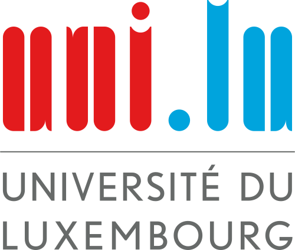

# About

The lattice land project is developed at the University of Luxembourg by a [wonderful team](https://ptal.github.io).

## Our Sponsors

This is the list of projects supported by Luxembourg National Research Fund (FNR):

* 2026—2029: _Neuro-Symbolic Reasoning for Embedded System Architectures Design_ (NEURESA), FNR AI-HPC BRIDGES 1.1M€ with [Cognifyer](https://cognifyer.ai/), ref. 2025/IS/19833538/NEURESA (PI: Pierre Talbot)
* 2022—2025: _A Concurrent Model of Computation for Trustworthy GPU Programming_ (COMOC), FNR CORE 387k€, ref. C21/IS/16101289 (PI: Pierre Talbot)

