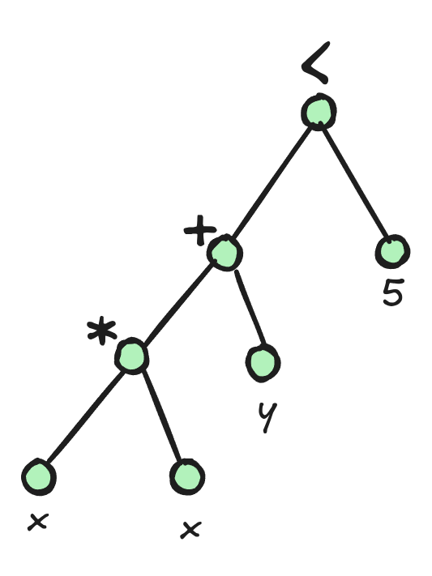
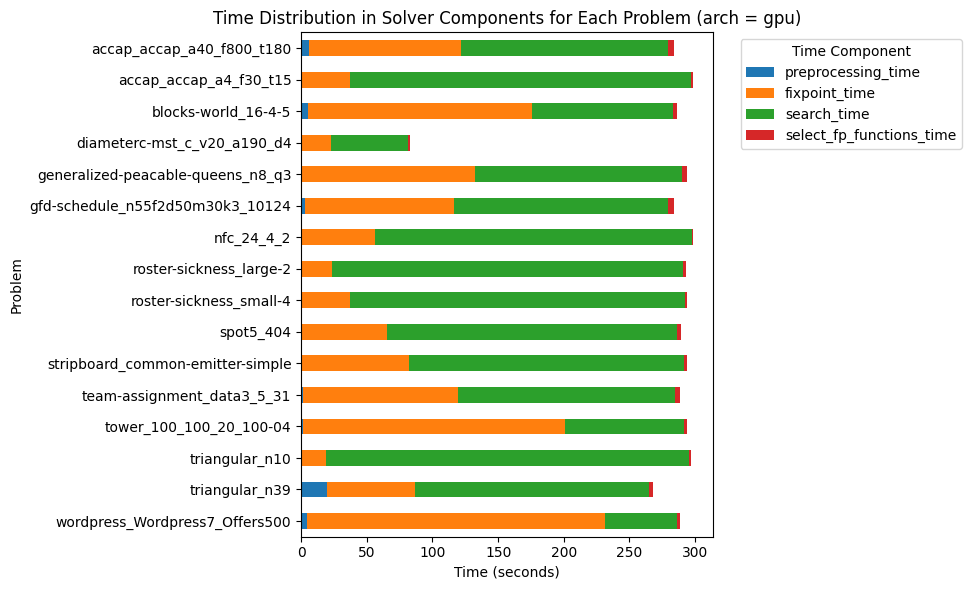
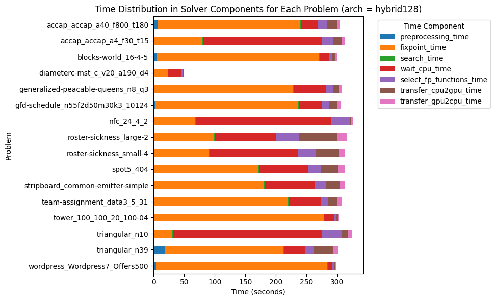

# v1.2.4: Ternary Normal Form

_27 December 2024_ During the hackathon with Nvidia, we profiled the code and discovered that the representation of propagators was problematic.
Let's take an example with the constraint `x * x + y < 5` which is internally represented by the following AST:



Because the constraints can have any arity and be arbitrarily deep, we have no choice but to represent this tree with pointers and dynamic memory allocation.
In Turbo, we used [variant](https://en.cppreference.com/w/cpp/utility/variant) and [shared_ptr](https://en.cppreference.com/w/cpp/memory/shared_ptr) to represent propagators.
The propagators are executed using a switch statement of the following form:
```cpp
switch(term.index()) {
  case IVar:
  case IConstant:
  case INeg:
  case IAdd:
  case ISub:
  case IMul:
  // ...
```

In the profiling report, it is shown that `switch(term.index())` generates a lot of uncoalesced accesses.
Previously, we have reduced divergent branches by sorting propagators with the same shape (see [sorting propagators](https://lattice-land.github.io/6-turbo.html)).
But the main issue was the uncoalesced accesses to the propagators.

To address this, we propose decomposing the problem into constraints that can be represented without pointers (fixed depth) and that are small (to enable coalesced memory load).
For this purpose, we introduce a new problem decomposition call the _ternary normal form_ (TNF) where all propagators are of the form `x = y <op> z` with `x,y,z` variables.
Furthermore, we take a minimal set of operators that includes the arithmetic operators `+,-,*,/,min,max` and two comparison operators `<=, =`.
All the other constraints are rewritten into those operators.
The constraint `x * x + y < z` in TNF is:
```
t1 = x * x
t2 = t1 * y
ONE = (t2 <= z)
```

Where `t1,t2,ONE` are new variables where `ONE` is initialized to `1`.
Note that the symbol `=` is relational, hence using `ONE = (t2 <= z)` forces the constraint on the right to be true.
This is called a "reified constraint" in the jargon of constraint programming, but in TNF it has the same representation as any other constraint.
TNF allows us to represent compactly a propagator using:
```cpp
struct bytecode_type {
  Sig op;
  AVar x;
  AVar y;
  AVar z;
};
```
`AVar` is an integer representing the index of the variable in the store and `Sig` is also an integer representing the operator.

## Problems in Ternary Normal Form

One obvious drawback of this approach is the increased number of temporary variables and constraints.
While the increase in the number of constraints is relatively low and stable across problems (between 1x and 4x), the increase in the number of variables ranges between 1x and 139x in the case of the Wordpress problem.
This variability warrants further investigation in the future to explore ways of reducing the number of generated variables.

| Problem | Data | #Vars | #Vars (TNF) | #Constraints | #Constraints (TNF) |
|----------|------|-------|-------------|--------------|--------------------|
| team-assignment | data3_5_31 | 15932.0 | 35445.0 (x2.22) | 25684.0 | 45197.0 (x1.76) |
| generalized-peacable-queens | n8_q3 | 2940.0 | 20186.0 (x6.87) | 8273.0 | 25519.0 (x3.08) |
| spot5 | 404 | 1112.0 | 22053.0 (x19.83) | 8124.0 | 29065.0 (x3.58) |
| nfc | 24_4_2 | 169.0 | 527.0 (x3.12) | 222.0 | 580.0 (x2.61) |
| blocks-world | 16-4-5 | 49447.0 | 109068.0 (x2.21) | 73421.0 | 133042.0 (x1.81) |
| triangular | n39 | 3863.0 | 207966.0 (x53.84) | 105136.0 | 309239.0 (x2.94) |
| accap | accap_a4_f30_t15 | 530.0 | 2319.0 (x4.38) | 993.0 | 2782.0 (x2.80) |
| tower | 100_100_20_100-04 | 12547.0 | 38559.0 (x3.07) | 23257.0 | 49269.0 (x2.12) |
| roster-sickness | small-4 | 4980.0 | 7978.0 (x1.60) | 6067.0 | 9116.0 (x1.50) |
| accap | accap_a40_f800_t180 | 28494.0 | 147451.0 (x5.17) | 58616.0 | 177573.0 (x3.03) |
| diameterc-mst | c_v20_a190_d4 | 3045.0 | 7336.0 (x2.41) | 6962.0 | 11253.0 (x1.62) |
| triangular | n10 | 267.0 | 1370.0 (x5.13) | 765.0 | 1868.0 (x2.44) |
| wordpress | Wordpress7_Offers500 | 667.0 | 92695.0 (x138.97) | 30893.0 | 122921.0 (x3.98) |
| roster-sickness | large-2 | 22952.0 | 29840.0 (x1.30) | 25693.0 | 32653.0 (x1.27) |
| stripboard | common-emitter-simple | 2123.0 | 14581.0 (x6.87) | 4563.0 | 17093.0 (x3.75) |
| gfd-schedule | n55f2d50m30k3_10124 | 32604.0 | 67749.0 (x2.08) | 54575.0 | 89720.0 (x1.64) |

## Benchmarks

The following table compares hybrid v1.2.3 and hybrid v1.2.4, both with 128 blocks.

| Metrics | Normalized average [0,100] | Δ v1.2.3 | #best (_/16) | Average | Δ v1.2.3 | Median | Δ v1.2.3 |
|---------|----------------------------|----------|--------------|---------|----------|--------|----------|
| Nodes per second | 83.75 | +29% | 11 | 21808.77 | +18% | 6061.18 | +48% |
| Fixpoint iterations per second | 100.00 | +254% | 16 | 845483.88 | +553% | 143327.93 | +193% |
| Fixpoint iterations per node | 100.00 | +187% | 0 | 40.45 | +138% | 22.76 | +148% |
| Propagators memory | 19.91 | -80% | 15 | 0.85MB | -90% | 0.42MB | -89% |
| Variables store memory | 100.00 | +656% | 0 | 402.75KB | +718% | 208.20KB | +1844% |

Let's analyze the speedup of this new version v1.2.4.
The number of fixpoint iterations per second has increased by 254% which is a very large gain.
However, the increase in nodes per second is only 29%, and it increases in only 11 out of 16 problems.
There are two reasons behind this discrepancy:

1. The convergence of the fixpoint loop is two times slower than in v1.2.3, likely due to improper sorting of the TNF propagators.
In all 16 problems, the new version requires more iterations to converge compared to v1.2.3.
2. The increase in variables results in fewer problem being stored in shared memory: only 3 out of 16 in comparison to 11 out of 16 before.

The first point is somewhat mitigated by the number of fixpoint iterations per second which almost double, demonstrating the effectiveness of TNF for GPU architecture.
Perhaps more surprisingly, the memory footprint of the propagators is much lower than in v1.2.3, with an average reduction of 80%.
Although we have more propagators, each one requires only 16 bytes, as opposed to v1.2.3, where propagator representation involved additional overhead from the shared pointer and variant data structures.

As for the full GPU version, we notice a similar behavior (we compare against full GPU v1.2.0 because v1.2.{1-3} were only modifying the hybrid version):

| Metrics | Normalized average [0,100] | Δ v1.2.0 | #best (_/16) | Average | Δ v1.2.0 | Median | Δ v1.2.0 |
|---------|----------------------------|----------|--------------|---------|----------|--------|----------|
| Nodes per second | 89.02 | +28% | 12 | 14467.35 | +24% | 5583.57 | +50% |
| Fixpoint iterations per second | 100.00 | +315% | 16 | 510492.99 | +586% | 136773.93 | +238% |
| Fixpoint iterations per node | 100.00 | +203% | 0 | 40.47 | +167% | 24.07 | +162% |
| Propagators memory | 19.91 | -80% | 15 | 1.03MB | -90% | 0.51MB | -89% |
| Variables store memory | 100.00 | +630% | 0 | 402.93KB | +715% | 208.39KB | +1813% |

## Profiling

The hackathon reminded me that we should always prioritize the next improvement based on what the profiler reveals.
While this is a well-known principle, it's easy to forget.

During the hackathon, we mainly used the tool `ncu` to profile our kernels.
It creates a report that can be visualized with `ncu-ui` and provides various metrics, such as the overall utilization of the SMs, the number of uncoalesced accesses and their locations in the code, the L1/L2 cache hit rates, warp state statistics, and more.
It was in this report we identified the issues with the previous AST-based representation of the propagators.
Among the remaining issues, the report tells us that warps are spending most of their time waiting on `__syncthreads()` barriers or global memory loads.

Beyond those low-level GPU optimizations, we can also examine the overall behavior of the constraint solver to identify which parts of the algorithm need further optimization.
To achieve this, we equipped Turbo with time counters to track where most of the time is spent in the code.
Let's first focus on the full GPU architecture (`-arch gpu`).



Clearly, the preprocessing time and the time spent eliminating the entailed propagators (from v1.2.3) are negligible.
The orange section represents the propagation time, and the green section represents the search time.
Prior to optimizing the propagation, the search accounted for about 10-20% of the total time.
However, it has now become a clear candidate for further optimization.
In the full GPU architecture, the search is handled by a single GPU thread which is why it is quite slow.

Next, we look at the hybrid architecture (`-or 128 -arch hybrid`).



Firstly, it is clear that searching on the CPU and memory transfers are not (yet) the bottleneck of the hybrid algorithm.
The time spent in the fixpoint loop is somewhat similar to the full-GPU architecture.
The main difference is the significant amount of time spent waiting for the CPU, as represented by the red section.
One possible explanation is that we have too many CPU threads, while the CPU has few cores (only 10).
To confirm this hypothesis, we should test this version on the GH200, which is powered by a 72-cores ARM CPU.

Based on these charts, there are at least two opportunities to improve efficiency:
1. Continue optimizing the fixpoint loop (this would benefit both architectures, and potentially provide even greater improvements for the hybrid architecture on a CPU with many cores).
2. Parallelize the search (this would benefit only the full-GPU architecture).

From a research perspective it is more interesting to focus on the fixpoint loop parallelization.
Furthermore, improving the full-GPU version---which does not compile on modern GPUs---is less exciting.
