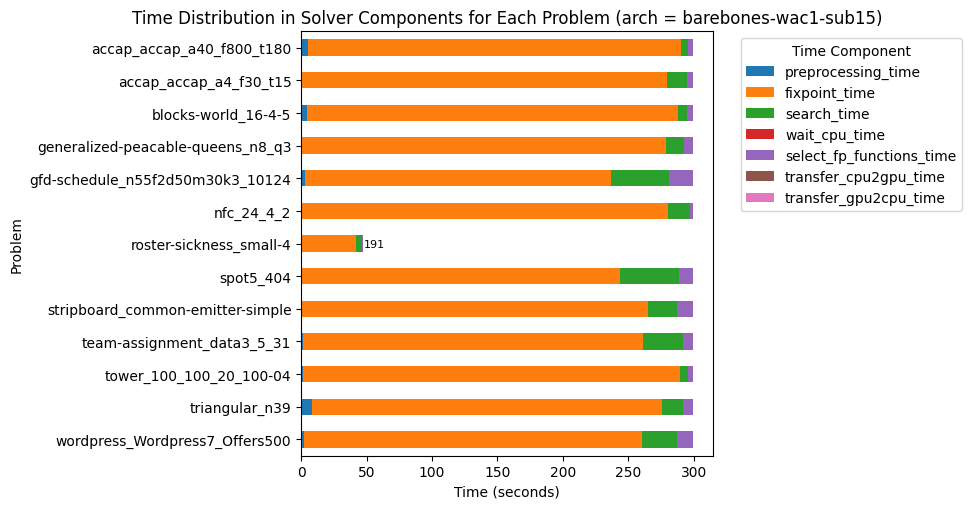

# v1.2.8: Cost of Abstraction

_10 April 2025._ Version 1.2.8 introduces a new solving algorithm called `barebones`, which can be activated via the option `-arch barebones`.
This architecture strips away some abstractions to reduce kernel code complexity and ensure compatibility with H100 GPUs.

While less generic than the existing algorithms, `barebones` is significantly more efficient—delivering up to +63% nodes per second and, for the first time, proving optimality on three instances.

### Minimalist by Design

The key design decision is to remove dependencies on `SearchTree` and `BAB` abstract domains.
The entire search process is implemented in a single file, `barebones_dive_and_solve.hpp` (about 1000 LOC), compared to 700 LOC for `gpu_dive_and_solve.hpp` and 800 LOC for `hybrid_dive_and_solve.hpp`.

Despite losing generality, we retain full functionality.
In theory, we could add any constraint to the search tree during solving, but this feature was not used.
The only dynamically added constraint is the objective bound—now directly handled with interval domains, reducing overhead.

Similarly, instead of supporting arbitrary branching like `x < y ∨ x = y ∨ x > y`, we stick to binary strategies such as `x < 10 ∨ x ≥ 10`, which can be efficiently implemented with two intervals: `[xl, 9]` and `[10, xu]`.

### Parallel Branching & Restoration

With simplified branching and fewer abstractions, search becomes easier to parallelize.

Branching strategies (variable + value selection) now leverage parallel iteration over the variable store, e.g., to find the smallest domain.
Restoring the variables' domain upon backtracking is also done in parallel.

This significantly reduces search time, which is now negligible compared to propagation.
This was not the case in the GPU and hybrid versions, as illustrated in [previous experiments](https://lattice-land.github.io/10-turbo.html#profiling).

As shown above, on the "roster-sickness_small-4" instance, 191 blocks remain idle at timeout, indicating load imbalance.
Improving work decomposition across threads is a near-term priority.

### Automatic Block Configuration

Previously, the number of CUDA blocks was set manually using `-or`, e.g. `-or 128`.
Now, you can enable automatic configuration via `-or 0`. It uses CUDA’s `cudaOccupancyMaxActiveBlocksPerMultiprocessor` to maximize the number of blocks per SM.
We then attempt to fit the variable and propagator stores into shared memory with the selected configuration.
The goal is to favor higher occupancy, even if it means using global memory in some cases.

### Benchmark Results (A5000)

Using `-or 128 -arch barebones -fp wac1`, the performance gains are substantial:

| Metrics | Normalized average [0,100] | Δ v1.2.7 | #best (_/16) | Average | Δ v1.2.7 | Median | Δ v1.2.7 |
|---------|----------------------------|----------|--------------|---------|----------|--------|----------|
| Nodes per second | 99.87 | +49% | 15 | 211302.32 | +351% | 34413.66 | +22% |
| Deductions per node | 95.80 | -3% | 9 | 815118.16 | 0% | 185548.13 | -16% |
| Fixpoint iterations per second | 99.97 | +47% | 15 | 1541334.10 | +248% | 437091.95 | +34% |
| Fixpoint iterations per node | 96.45 | -2% | 9 | 14.52 | -3% | 9.29 | -9% |
| Propagators memory | 99.99 | 0% | 9 | 0.64MB | 0% | 0.25MB | 0% |
| Variables store memory | 100.00 | 0% | 0 | 288.40KB | 0% | 89.06KB | 0% |

With automatic block configuration (`-or 0`), we gain an additional speed-up:

| Metrics | Normalized average [0,100] | Δ v1.2.7 | #best (_/16) | Average | Δ v1.2.7 | Median | Δ v1.2.7 |
|---------|----------------------------|----------|--------------|---------|----------|--------|----------|
| Nodes per second | 99.17 | +63% | 15 | 262153.55 | +459% | 43555.10 | +54% |
| Deductions per node | 96.52 | -1% | 6 | 823142.05 | +1% | 191625.76 | -13% |
| Fixpoint iterations per second | 99.62 | +65% | 15 | 1925882.39 | +334% | 502630.01 | +54% |
| Fixpoint iterations per node | 97.11 | -1% | 6 | 14.95 | 0% | 9.31 | -9% |
| Propagators memory | 99.99 | 0% | 9 | 0.64MB | 0% | 0.25MB | 0% |
| Variables store memory | 100.00 | 0% | 0 | 288.40KB | 0% | 89.06KB | 0% |

### Results Summary

| Metrics | `barebones` | `hybrid` |
|---------|-------|----------|
| #Problems at optimality | 3 | 0 |
| #Problems satisfiable | 11 | 14  |
| #Problems unknown | 2 | 2  |
| #Problem with store in shared memory | 1 | 6  |
| #Problem with prop in shared memory | 0 | 0  |
| #Problems with IDLE SMs at timeout | 1 | 2 |

This is the first time the solver could prove optimality on three problems within a 5-minute timeout.
It validates the trade-off: by removing abstraction, we unlock performance and simplify the codebase—without losing what matters.