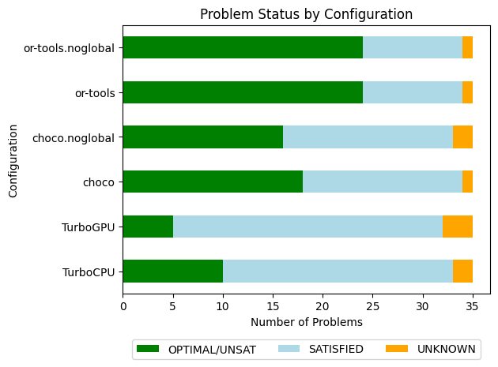
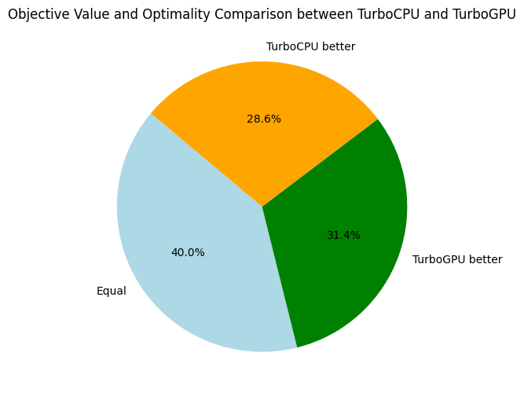
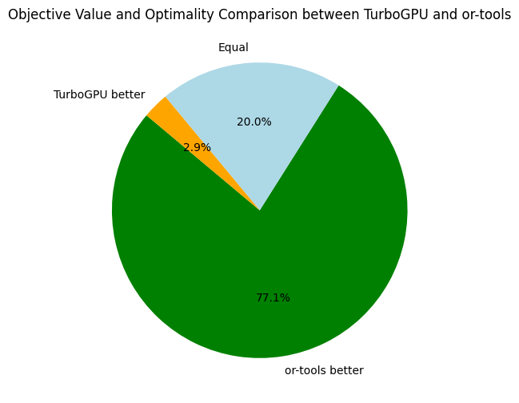
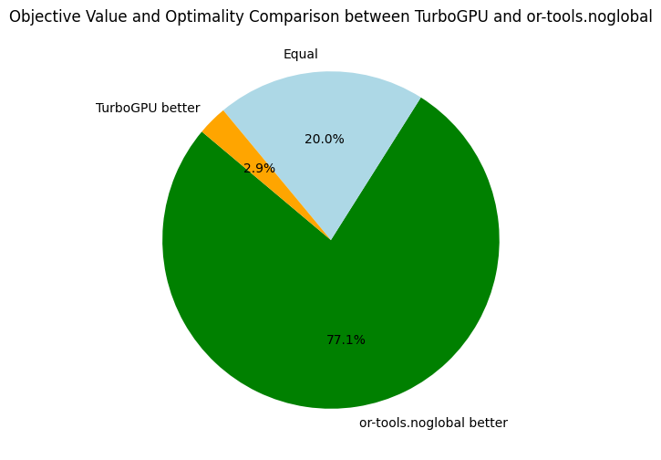
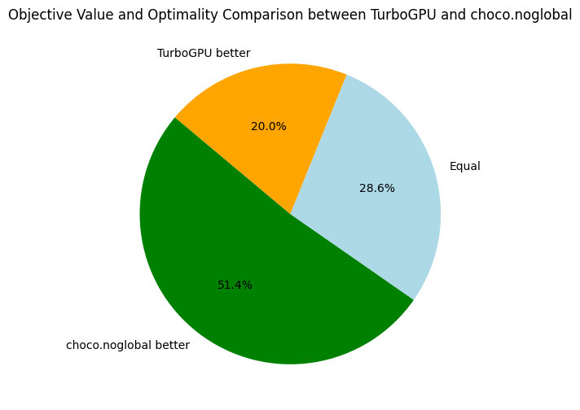
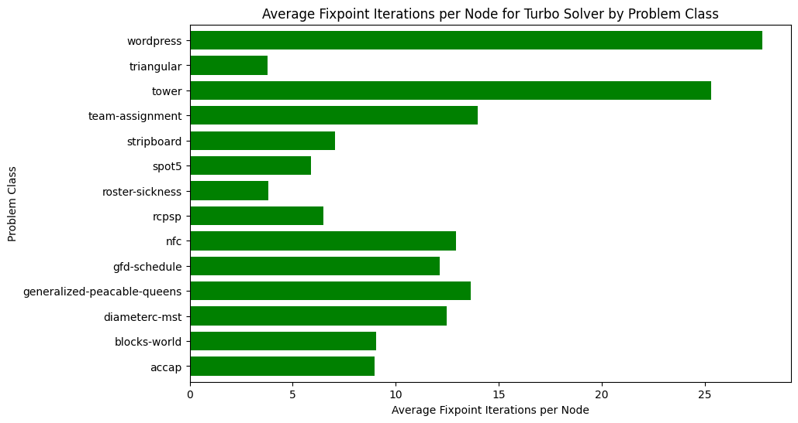

# v1.0.1: Unoptimized Turbo

_08 November 2023._ We start this adventure with a functional but slow GPU solver.
To make it work on the GPU, we had to simplify the architecture of mainstream CPU-based constraint solver in many regards.
Let's start with the current design decisions behind Turbo:
* *Pure GPU*: From the beginning, we decided to develop Turbo entirely on the GPU, primarily to eliminate memory transfers between the CPU and GPU.
We are also forced to design each component with a parallel mindset.
* *Propagation*: The propagation loop is based on the very first AC1 algorithm: we simply take the first N propagators, run them in parallel, then take the next N propagators, and so on until they are all executed, where N is the number of cores available in the current block.
We repeat this operation in a fixed point loop until no change is detected anymore.
This implies we do not have a queue of propagators to be woken up or any notion of events in the solver.
* *Backtracking*: It is based on full recomputation, each time we backtrack, we re-apply all the decisions from the root node; actually, from the root of the current EPS subproblem being solved.
* *Embarrassingly parallel search*: We dynamically create subproblems that are explored individually by GPU blocks, hence the parallel propagation only happens inside one block.
* *Abstract domains*: The solver architecture is based on abstract domains which encapsulate solving algorithms dedicated to a particular constraint language, similarly to theories in SMT.
However, abstract domains are semantic objects while SMT theories are syntactic objects (and a formal connection exists between the two).
Our opinion is that abstract domains are closer to the actual implementation code than SMT theories.
Moreover, since a product of abstract domains is also an abstract domain, this framework offers promising perspectives for combining solving algorithms.
* *No conflict learning*: Conflicts require dynamic data structures to represent the implication graph, and memory allocation is quite costly on GPU, so we currently have no conflict learning.
* *Lock-free*: Although propagators are sharing the memory, we do not have locks on variables, and actually no lock at all (this is a lie: a single lock used for printing purposes).
* *Formally correct*: Parallel programming is hard and prone to bugs. The theory behind Turbo relies on lattice theory which enabled us to prove that our lock-free propagation loop is correct.

We have thrown away many optimizations considered essential in mainstream CPU-based constraint solvers.
Incidentally, the GPU solver is simpler than a CPU solver, while obtaining similar performances; of course, when comparing to a pure CP solver without SAT learning.
Back in 2021, our hypothesis was that drastically simplifying the solver design was necessary to implement a GPU solver and that it could be efficient.
We implemented a [prototype (Turbo)](https://github.com/ptal/turbo/tree/aaai2022) demonstrating it could work: we obtained similar performances between Turbo and Gecode (on a 6-cores CPU with 12 threads) on RCPSP.
More importantly, we laid out the theory behind parallel constraint propagation on GPU and show that, despite the absence of locks, it yielded correct results.
These findings were summarized in our [AAAI 2022 paper](http://hyc.io/papers/aaai2022.pdf).

For more than one year, I have been refactoring and extending this initial prototype in multiple ways.
One goal has been achieved now and Turbo can solve MiniZinc model with two limitations: for now, it only supports integer variables, and all global constraints are decomposed into primitive constraints.
The solver Turbo is part of a larger project called _Lattice Land_, which is a collection of libraries representing lattice data structures.
The long-term goal is to be able to reuse these libraries outside of constraint solving, for instance in static analysis by abstract interpretation and in distributed computing using CRDT.
The code of Turbo is the glue putting together the required libraries to solve a constraint problem.
The new _abstract domain_ design comes with a price: it is less efficient than the prototype.
It was expected since the prototype could only handle a very small constraint language with limited architectural overhead.
I will try to integrate one by one various optimizations and attempt to first reach the previous efficiency, and then go beyond it.

## Benchmarking

To benchmark our progresses, I think it is reasonable to start with a set of easy instances (J30 benchmarks on RCPSP) and a set of harder instances (from MiniZinc competition 2022).
I have selected a subset of the MiniZinc competition benchmarks where I discarded models with set variables (unsupported by Turbo).
For a representative but quicker benchmarking, I selected 1 or 2 instances per problems, arbitrarily varying between small and large instances.
For RCPSP, I randomly selected 19 instances of the J30 dataset.
In the following table, I describe the problems of the benchmarking suite (`diffn` (1) indicates one occurrence of the global constraint, `alldifferent` (\*) indicates the global constraint occurs in redundant or symmetry breaking constraints).

### Description

* Wordpress: Assign software components to hardware units under some constraints.
* ACCAP: Airport check-in counter allocation problem (ACCAP) with fixed opening/closing times.
* Tower: Assign handsets to communication towers to maximize connection quality.
* Team: Make teams of players to maximize happiness and balancing.
* NFC: Network flow global constraint.
* Diameterc-mst: Diameter Constrained Minimum Spanning Tree.
* Stripboard: Layout for electrical components on stripboard: find the most compact layout.
* Blocks world: Find a path of minimum length from an initial configuration to a final configuration of the puzzle.
* Triangular: Puzzle.
* Generalized-peacable Queens: A variant of n-queens with several armies of queens.
* Roster Sickness: Assign employees to work shifts with expertise constraints.
* GFD Schedule: Productions of group of items in various facilities.
* RCPSP: Minimize makespan of tasks under resources constraints.
* Spot 5: Select a subset of photograph to be taken maximizing a weight.

| Problem | #Inst | Kind | Global Constraints | Shape |
|---------|------------|-------------|--------------------|-------|
| Wordpress | 1 | Allocation | None | Many `sum()()`. |
| ACCAP | 2 | Allocation | `diffn` (1) | Precedence constraints. |
| Tower | 1 | Allocation | None | |
| Team Assignment | 1 | Allocation | `bin_packing_load`, `alldifferent` (\*), `bin_packing` (1\*) | Sums of Boolean. |
| NFC | 1 | Graph | `network_flow_cost` | Equality/sum constraints. |
| Diameterc-mst | 1 | Graph | None | Many implications / disjunctions.  |
| Stripboard | 2 | Packing | `diffn` (1), `disjunctive` (1), `alldifferent` (1\*), `strictly_decreasing` (1\*) | Many implications. |
| Blocks world | 1 | Planning | `increasing` (1), `global_cardinality_closed` | |
| Triangular | 2 | Puzzle | None | Sum constraints. |
| Generalized-peacable Queens | 1 | Puzzle | `regular`, `global_cardinality` (1), `all_equal` (1), `value_precede_chain` (1\*), `lex_lesseq` (\*) | Almost only global constraints. |
| Roster Sickness | 1 | Scheduling | None | Lexicographic optimization. |
| GFD Schedule | 1 | Scheduling | `cumulative`, `at_most`, `nvalue` | Many implications / disjunctions. |
| RCPSP | 18 | Scheduling | `cumulative` | Precedence constraints, disjunctions. |
| Spot 5 | 1 | Ad-hoc | `table` | |

### Analysis

The primary goal of our initial benchmarking session is to gauge how Turbo measures up against contemporary, state-of-the-art constraint solvers (spoiler: there's room for improvement).
In order to assess the efficiency of Turbo, I compared it against Choco and Or-Tools:

* [Turbo](https://github.com/ptal/turbo/tree/v1.0.1) v1.0.1: C++/CUDA constraint solver without SAT clause learning and without global constraints.
* [Choco](https://github.com/chocoteam/choco-solver) v4.10.13: Java constraint solver without SAT clause learning and with global constraints.
* [Or-Tools](https://github.com/google/or-tools) v9.6: C++ constraint solver with SAT clause learning and global constraints.

Since Turbo has no global constraint, I also benchmarked the two previous solvers on problem with decomposition of global constraints, named `choco.noglobal` and `or-tools.noglobal` below.
Turbo is developed to run on both CPU and GPU, although it is primarily optimized for GPU use.
We run on the CPU mainly for debugging and comparative efficiency analysis.

The machine on which I performed the benchmarks is a Dell Precision 5820 (desktop computer):

* CPU: Intel Core i9-10900X (3,7GHz, 4,7GHz Turbo, 10C, cache 19,25Mo, HT, 165W).
* RAM: 64 Go, 2 x 32 Go, DDR4 UDIMM.
* GPU: NVIDIA RTX A5000, 24Go, 64 streaming multiprocessors (8192 CUDA cores), 230W.

About the details of the experiments:

* Timeout: 5 minutes per instance (it is relatively small in order to quickly iterate and test new optimizations of Turbo).
* EPS (TurboGPU): generate 1024 subproblems (`-sub 10` for "2^10").

_Warning_: Before we start, let's get something straight: *the comparison between TurboGPU and other solver is relatively unfair.*
In particular, because of EPS, TurboGPU uses breadth-first search at the top of the tree, and thus sometimes can get better bounds, while the others use depth-first search and might stay stuck in the left part of the search tree longer.
In contrast, on some problems, depth-first search allows TurboCPU to find a better bound because it goes deeper in the search tree.
To be completely fair, we should enable parallelism for each solver since most of them support it.
We don't because when you run a race, you don't try to overtake the 1th runner when you are at the back of the race, you first focus on overtaking the runner in front of you ;-)

Alright, let's go with the benchmarks, the full Jupyter notebook is available [here](https://github.com/ptal/turbo/blob/v1.0.1/benchmarks/analysis-v1.0.1.ipynb).
We first start by an overview:

The overall results are not surprising.
When looking at Choco and Or-Tools, we might wonder if global constraints are worth the investment, especially when clause learning is activated (Or-Tools).
In the following, we take a closer look at Choco and Or-Tools:

Here, we only compare the objective bounds and not the time needed to reach the best found objective.
Back to Turbo, let's compare it to our its CPU-version and the baseline solvers:

For future references, it is interesting to have an average of some speed and memory metrics across all problems:

| Metrics | Average | Median |
|---------|------------|-------------|
| Nodes per seconds | 1246.77 | 35.07 |
| Fixpoint iterations per node | 8.48 | 7.11 |
| IDLE SMs at timeout | 13 | |
| Propagators memory | 16.41MB | 13.07MB |
| Variables store memory | 167.78KB | 174.01KB |

When comparing the number of nodes per second, we can see that TurboGPU explores around 5 to 10 times more nodes per second than TurboCPU; showing a "purely computational gain" when using the GPU.
Just 5x to 10x quicker is actually not that much quicker considering we have 64 streaming multiprocessors, and indicate we are under-using the parallel capacities of the GPU.
In the future, I'll benchmark how efficiently Turbo is using the GPU using the profiling tools of NVIDIA.

You might notice that on RCPSP, TurboCPU is actually better in terms of nodes per second.
The reason is that the number of subproblems is not large enough, and some streaming multiprocessors become IDLE because no more problems can be consumed.
On two problems, we have only one streaming multiprocessors working, meaning only 1/64 of the GPU is used at the end...
We need to improve the EPS algorithm and the decomposition into subproblems.

Finally, let's look at the fixpoint iterations.
On average, Turbo needs to execute each propagator 8 times before reaching a fixpoint, of course it depends on the problem:

To conclude this first benchmarking session, I found the results encouraging, especially when considering how primitive is the propagation loop.
I think two important missing optimizations are:
1. Preprocessing in the root node, potentially root nodes of each subproblem, to reduce the number of constraints and variables, and avoid useless propagation.
2. Disable propagators that are entailed.

See you next time for more benchmarking!
