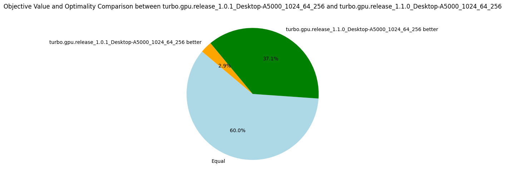
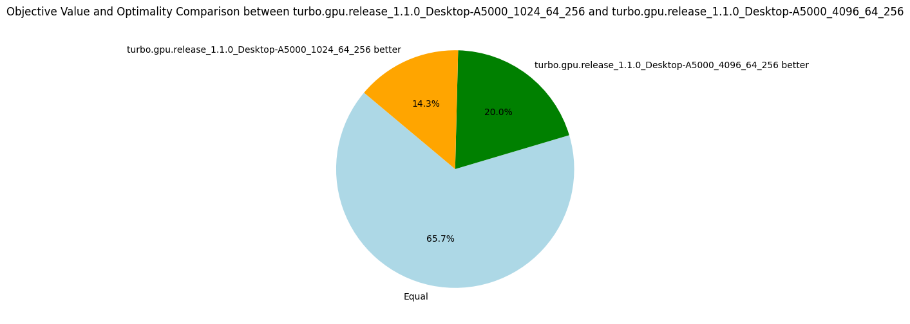
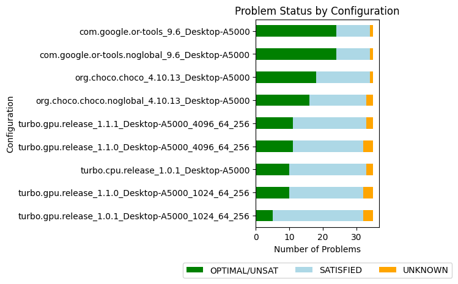

# v1.1.{0-1}: Preprocessing

_27 December 2023._ A simple definition of _preprocessing_ is to prepare the constraint problem hence it can be solved more efficiently by the underlying solver.
The goal of preprocessing is usually to eliminate fixed variables, eliminate satisfied constraints and simplify constraints, for instance by propagating the constants.
In the context of GPU, there is an additional incentive to preprocessing: reducing the memory footprint in order to store the problem in the shared memory (L2 cache).
For now, most of the problems are too large to be entirely stored in shared memory (store of variables and propagators), but the variables can be entirely stored in the shared memory for around 30% of the problems considered.
We have implemented a simple preprocessing class called `Simplifier` (in lala-core).
After propagating the root node, the preprocessor performs the following simplifications:

1. Replace all assigned variables by the constant they are assigned to.
2. Create equivalence classes among variables (by detecting `x = y` constraints), select a representative variable in each class, and replace all occurrences of the variables in the equivalence classes by their representative variables.
3. Remove entailed constraints.

The preprocessing algorithm is in theory suitable for parallel execution on GPU, but it is currently executed on the CPU.
The reason is that we want to reduce the problem size to store the variables in the shared memory.
But we must decide in which memory to put the variables before we start the GPU kernel; hence we would need to launch the preprocessing in a kernel, to return the data to the CPU and relaunch another kernel with the right shared memory size.
There is a solution using CUDA dynamic parallelism, but I did not take the time to explore it yet!

This simple preprocessing step doubles the raw efficiency of the solver as measured by the number of nodes explored per second.
Indeed, reducing the problem leads to fewer propagators that need to be executed, which is observed by a reduction of the number of iterations to reach a fixpoint (-14% on average).
But the additional speed is also explained by the variables store that has been cut by half on average and the propagators' memory decreased by 22%.
It reduces the pressure on the L1 and L2 caches and more problems can be stored in the shared memory; in our case, one more problem can be stored in shared memory when simplifying.

| Metrics | Average | Δ v1.0.1 | Median | Δ v1.0.1|
|---------|---------|----------|--------|---------|
| Nodes per seconds | 2379.95 | +91% | 611.27 | +1742% |
| Fixpoint iterations per second | 12303.02 | +23% | 2273.83 | +882% |
| Fixpoint iterations per node | 7.31 | -14% | 5.9 | -17% |
| #Problems with IDLE SMs at timeout | 9 | 13 |||
| Propagators memory | 12.65MB | -22% | 7.79MB | -40% |
| Variables store memory | 72.29KB | -57% | 84.1KB | -52% |
| #Problems at optimality | 10 | 5 | ||
| #Problems satisfiable | 22 | 27 | ||
| #Problems unknown | 3 | 3 | ||

## v1.1.0b Increasing the number of subproblems

By default, the number of subproblems created is 1024 (2^10) (option `-sub 10`).
This choice is rather arbitrary, so I ran additional experiments to see if increasing that number could lead to better results.
The answer is that it is quite hard to choose a good generic number, but overall 4096 (2^12) subproblems gave better results and is the new default for the future versions.

| Metrics | Average | Δ v1.1.0 | Median | Δ v1.1.0 |
|---------|---------|----------|--------|---------|
| Nodes per seconds | 2529.68 | +6% | 809.31 | +32% |
| Fixpoint iterations per second | 12449.48 | +1% | 3306.37 | +45% |
| Fixpoint iterations per node | 6.77 | -7% | 5.19 | -12% |
| #Problems with IDLE SMs at timeout | 7 | 9 |||
| Propagators memory | 12.65MB | 0% | 7.79MB | 0%|
| Variables store memory | 72.29KB | 0% | 84.1KB | 0%|
| #Problems at optimality | 11 | 10 | ||
| #Problems satisfiable | 21 | 22 | ||
| #Problems unknown | 3 | 3 | ||

In particular, we see that increasing the number of subproblems to 4096 contributes to a better average of nodes per second and to solving one more problem to optimality.
With more subproblems, the advantage is not as clear, but it is definitely an experiment to try again on future versions of Turbo.

## v1.1.1 Partial evaluation

The version 1.1.1 brings partial evaluation of the logical formulas, essentially by aggregating constants and rewriting constraints with fewer operators.
We fully evaluate the expressions without variables, using distributivity laws for addition and multiplication (e.g. in `4 + x + 1` we evaluate `4 + 1`).
We apply some standard simplification laws:
* Propagating neutral and absorber elements (using identity and annihilator laws) of conjunction, disjunction, implication, equivalence, addition, subtraction, multiplication and division.
* Eliminating double arithmetic and logical negations.

We also have a bunch of rules to simplify constraints that are generated by the MiniZinc to FlatZinc conversion (let `eval` be a function evaluating the constant expressions):
* Detecting equalities: `x + (-y) == 0` is rewritten to `x == y`.
* Detecting inequalities: `x + (-y) != 0` is rewritten to `x != y`.
* Aggregating constants: `x + i != j` is rewritten to `x != eval(j - i)`.
* Eliminating variable negation: `-x != j` is rewritten to `x != eval(-j)` (and similarly for `j != -x`).

These rules could be generalized in the future.

This simple optimization leads to another big leap in the number of nodes per second and reduces significantly the memory footprint of propagators.
For the first time, there is a problem (nfc_24_4_2) that can be entirely stored in the shared memory (store of variables and propagators).
However, the impact of being entirely in the shared memory is not very impressive, with "only" 42% more nodes per second in comparison to v1.1.0b, knowing the average is at 62%.
We should validate experimentally if manually managing the shared memory is really worth it, or if the default caching policy of CUDA does a good enough job.

| Metrics | Average | Δ v1.1.0b | Median | Δ v1.1.0b |
|---------|---------|----------|--------|---------|
| Nodes per second | 4087.42 | +62% | 976.72 | +21% |
| Fixpoint iterations per second | 17837.83 | +43% | 3878.13 | +17% |
| Fixpoint iterations per node | 6.79 | +0.3% | 5.17 | -0.4% |
| #Problems with IDLE SMs at timeout | 8 | 7 |||
| Propagators memory | 10.34MB | -18% | 7.39MB | -5% |
| Variables store memory | 72.29KB | 0% | 84.1KB | 0%|
| #Problems at optimality | 11 | 10 | ||
| #Problems satisfiable | 22 | 22 | ||
| #Problems unknown | 2 | 3 | ||

## Overall standing

