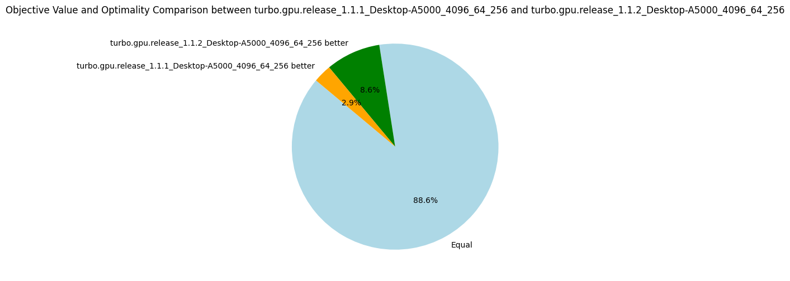

# v1.1.2: (Dis)equality Propagator

_07 March 2024._ When developing Turbo, I try to keep the number of propagators minimal as it reduces the code and eases the maintenance.
The propagators are represented in an abstract domain called _propagators completion_ (PC) which is essentially an encapsulation of a traditional propagators-based constraint solver inside an abstract domain.
One of the peculiarities is that PC does not contain the store of variables but is parametrized by another abstract domain `A` that provides access to the variables.
`A` can be an array of integer intervals or bitsets, as seen in traditional constraint solver, but can be more complicated such as an octagon abstract domain.
This generic design also allows us to parametrize PC by the Cartesian product of any abstract domains, for instance to obtain mixed domains such as interval of integers and interval of floating-point numbers.
It means that we have a single propagator for the constraint `x + y <= 10` where `x` is an integer variable and `y` a real variable; this is in theory because Turbo does not support floating-point variables yet.
The direct consequence of this abstraction is that we must develop generic propagator functions that do not know exactly the shape of the variables' domains.
To achieve that, I have a lattice-based propagator of the form `t >= u` where `t` is any term (e.g. `x + y` or `S ∪ T`), `u` is a lattice element such as an interval and `>=` is the associated lattice ordering.
Let `project(a, x)` be a function of the abstract domain `a` projecting the domain of the variable `x` and let's suppose the type of `project(a, x)` is the same as the type of `u`.
For instance, if I write `x + y >= [0..5]`, it means that `project(a, x) + project(a, y)` should be included in the interval `[0..5]` according to the interval ordering.
From a logical perspective, it implements the constraints `x + y >= 0` and `x + y <= 5`.
Using some generic lattice operations (essentially projection, ordering and join operator), we can perform the propagation of this constraint.
If the underlying domain is an interval, it will achieve bound consistency, and if it is a bitset, it should achieve arc consistency; I say "should" because I did not formally prove that yet.

This lattice-based propagator is quite compact because it can represent many primitive constraints, for instance:

* `x == y` is `x - y >= [0..0]`.
* `x != y` is `x - y >= [1.. ∞] \/ x - y >= [-∞..-1]`.
* `x + y >= 1` is `x + y >= [1..∞]`.
* ...

Therefore, we do not need one propagator per arithmetic comparison operator, but one propagator for all of them.
However, this minimalism is problematic for the disequality propagator which is represented by a disjunction.
Instead, we have implemented a dedicated propagator for disequality which does not rely on subtraction and disjunction.
By duality, this propagator can also be used for propagating equality which avoids a subtraction operation.
More fundamentally, for lattices that are pseudo-complemented (usually domains that support holes such as bitset), the disequality propagator is stronger than its disjunctive decomposition.

Interestingly, this propagator does not help to explore more nodes per second, but it finds better objective values for more problems (see the pie diagram below).
The number of nodes per second is due to an increase in the number of fixpoint iterations per nodes.
As the propagation strength between the two propagators should be the same (at least for intervals), I'm not sure why it takes more iterations to reach the fixpoint.
Finally, using these dedicated propagators reduces the propagators' memory in average, but the median increases.
The benchmarking set consists of many instances of the RCPSP problem, for which using these propagators increases the memory.
When discarding the RCPSP benchmarks, the median memory footprint of the propagators is actually reduced by a factor of 3, and the average memory is reduced by about 30%!
I'm unsure which constraints of the RCPSP model lead to this issue, but due to the limited impact I decided not to investigate.

| Metrics | Average | Δ v1.1.1 | Median | Δ v1.1.1 |
|---------|---------|----------|--------|---------|
| Nodes per seconds | 3778.83 | -7% | 1049.48 | +7% |
| Fixpoint iterations per second | 16935.39 | -5% | 3847.91 | -1% |
| Fixpoint iterations per node | 7.34 | +7% | 5.16 | -0.01% |
| #Problems with IDLE SMs at timeout | 8 | 8 |||
 Propagators memory | 9.01MB | -13% | 8.08MB | +9% |
| Variables store memory | 72.29KB | 0% | 84.1KB | 0%|
| #Problems at optimality | 11 | 11 | ||
| #Problems satisfiable | 22 | 22 | ||
| #Problems unknown | 2 | 2 | ||

