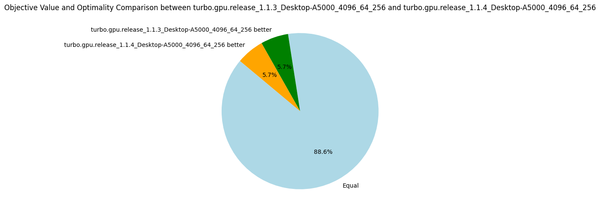

# v1.1.{4-5}: Sorting Propagators

_28 August 2024._ We perform two experiments to reduce thread divergence by sorting propagators, for the reasons mentioned in the [previous post](5-turbo.md).
Given a list of propagators representing constraints, we sort on the syntactic shape of the constraint:

* v1.1.4: Sort on the symbol of the outermost predicate of the formula, e.g. `x < y` is equal to `z + y < x * x`, but less than `x <= y` for an arbitrary ordering between < and <=.
* v1.1.5: Lexicographic sort on the first predicate symbol followed by the length of the formula, e.g. `length(x < y) = 2 < 3 = length(z + y < x * x)`.

These are quite simple solutions to reduce divergence while avoiding spending too much time on a sorting algorithm specialized to minimize divergence.
The results are not impressive, and it shows that thread divergence is perhaps not the biggest bottleneck of Turbo.
Nevertheless, given how cheap this optimization is, I decided to keep it.
Note that on some benchmarks where the propagators are very unsorted (e.g. `gfd_schedule`), sorting increases by 50% the number of nodes explored.

## Results v1.1.4

| Metrics | Average | Δ v1.1.3 | Median | Δ v1.1.3 |
|---------|---------|----------|--------|----------|
| Nodes per seconds | 4439.68 | +3% | 1236.87 | 0% |
| Fixpoint iterations per second | 21659.62 | +1% | 6492.20 | 0% |
| Fixpoint iterations per node | 8.69 | +1% | 5.07 | -5% |
| #Problems with IDLE SMs at timeout | 9 | 9 | |
| Propagators memory | 9.01MB | 0% | 8.08MB | 0% |
| Variables store memory | 72.29KB | 0% | 84.10KB | 0% |
| #Problems at optimality | 11 | 11 | |
| #Problems satisfiable | 22 | 22 | |
| #Problems unknown | 2 | 2 | |
| #Problem with store in shared memory | 10 | 10 | |
| #Problem with prop in shared memory | 1 | 1 | |

## Results v1.1.5

| Metrics | Average | Δ v1.1.3 | Median | Δ v1.1.3 |
|---------|---------|----------|--------|----------|
| Nodes per seconds | 4513.37 | +4% | 1243.61 | 0% |
| Fixpoint iterations per second | 21787.61 | +2% | 6612.26 | +1% |
| Fixpoint iterations per node | 8.50 | -1% | 5.38 | +1% |
| #Problems with IDLE SMs at timeout | 9 | 9 | |
| Propagators memory | 9.01MB | 0% | 8.08MB | 0% |
| Variables store memory | 72.29KB | 0% | 84.10KB | 0% |
| #Problems at optimality | 11 | 11 | |
| #Problems satisfiable | 22 | 22 | |
| #Problems unknown | 2 | 2 | |
| #Problem with store in shared memory | 10 | 10 | |
| #Problem with prop in shared memory | 1 | 1 | |

