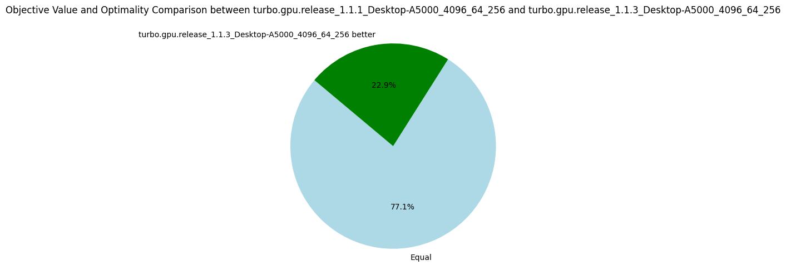

# v1.1.{4-5}: Sorting Propagators

_28 August 2024._ We perform two experiments to reduce thread divergence by sorting propagators, for the reasons mentioned in the [previous post](5-turbo.md).
Given a list of propagators representing constraints, we sort on the syntactic shape of the constraint:

* v1.1.4: Only sort on the first predicate symbol of the formula, e.g. `x < y` is equal to `z + y < x * x`, but less than `x <= y` for instance.
* v1.1.5: Lexicographic sort on the first predicate symbol followed by the length of the formula, e.g. `length(x < y) = 2 < 3 = length(z + y < x * x)`.

These are quite simple solutions to reduce divergence while avoiding spending too much time on a sorting algorithm specialized to minimize divergence.

## Results v1.1.4

| Metrics | Average | Δ v1.1.3 | Median | Δ v1.1.3 |
|---------|---------|----------|--------|---------|
| Nodes per seconds | 4439.67  4328.83 | +13% | 1240.06 | +15% |
| Fixpoint iterations per second | 21347.57 | +26% | 6519.14 | +69% |
| Fixpoint iterations per node | 8.61 | +15% | 5.31 | +3% |
| #Problems with IDLE SMs at timeout | 9 | 8 |||
| Propagators memory | 9.01MB | 0% | 8.08MB | 0% |
| Variables store memory | 72.29KB | 0% | 84.1KB | 0%|
| #Problems at optimality | 11 | 11 | ||
| #Problems satisfiable | 22 | 22 | ||
| #Problems unknown | 2 | 2 | ||

## Results v1.1.5

| Metrics | Average | Δ v1.1.4 | Median | Δ v1.1.4 |
|---------|---------|----------|--------|---------|
| Nodes per seconds | 4328.83 | +13% | 1240.06 | +15% |
| Fixpoint iterations per second | 21347.57 | +26% | 6519.14 | +69% |
| Fixpoint iterations per node | 8.61 | +15% | 5.31 | +3% |
| #Problems with IDLE SMs at timeout | 9 | 8 |||
| Propagators memory | 9.01MB | 0% | 8.08MB | 0% |
| Variables store memory | 72.29KB | 0% | 84.1KB | 0%|
| #Problems at optimality | 11 | 11 | ||
| #Problems satisfiable | 22 | 22 | ||
| #Problems unknown | 2 | 2 | ||

There are many possible optimizations to improve the efficiency of the fixpoint loop, in particular to avoid thread divergence.
I'm going next to try something very simple: to sort the propagators according to their structures, which should reduce divergence, we'll see!

The following pie charts show that the version v1.1.3 is strictly better than all others before, which validate the usefulness of our optimizations.

