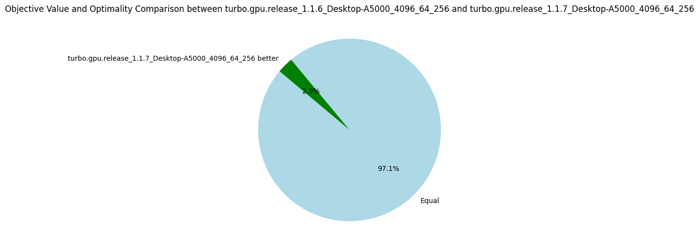

# v1.1.6: Sharing Propagators

_28 August 2024._ Each subproblem is currently solved independently in a CUDA block, and the solver state is duplicated on each block.
The propagators are never modified during solving and thus, can safely be shared among the blocks.
Considering the propagators consume on average 9MB (hence 64*9 = 576MB for all blocks) and the L2 cache is only 4MB (on my A5000 card), the data transfers between the global memory and the L2 cache only because of the propagators are quite intense.
In version 1.1.6, I share the propagators among the blocks using a new pointer type called `root_ptr` (from [cuda-battery](https://github.com/lattice-land/cuda-battery)).
A more classical `shared_ptr` is not safe to use to share data among blocks because the references counter is not protected against concurrent accesses, which can happen when two blocks call the copy constructor or the destructor of the shared pointer at the same time.
And this can lead to a segmentation fault.
The new `root_ptr` consider that the first owner of the pointer is the one that will also destroy it, which has the advantage of not required a references counter.
Of course, it is the responsibility of the programmer to delete the pointer after all blocks have terminated.

Once again, and similarly to the version 1.1.5, the improvement is not as great as expected with only 5% more nodes explored on average.

| Metrics | Average | Δ v1.1.5 | Median | Δ v1.1.5 |
|---------|---------|----------|--------|----------|
| Nodes per seconds | 4758.85 | +5% | 1287.70 | +4% |
| Fixpoint iterations per second | 23376.47 | +7% | 7228.01 | +9% |
| Fixpoint iterations per node | 8.74 | +3% | 5.39 | 0% |
| #Problems with IDLE SMs at timeout | 9 | 9 | |
| Propagators memory | 9.01MB | 0% | 8.08MB | 0% |
| Variables store memory | 72.29KB | 0% | 84.10KB | 0% |
| #Problems at optimality | 11 | 11 | |
| #Problems satisfiable | 22 | 22 | |
| #Problems unknown | 2 | 2 | |
| #Problem with store in shared memory | 10 | 10 | |
| #Problem with prop in shared memory | 1 | 1 | |

## v1.1.7: Changing the EPS Search Strategy (Bonus)

For fun and profits, I try to change the EPS search strategy to improve the benchmarks in a cheap and easy way.
It happens that selecting the smallest value of the smallest domain (first-fail) is a bit better than performing a bisection.

| Metrics | Average | Δ v1.1.6 | Median | Δ v1.1.6 |
|---------|---------|----------|--------|----------|
| Nodes per seconds | 4527.37 | -5% | 1287.14 | 0% |
| Fixpoint iterations per second | 25015.74 | +7% | 7100.85 | -2% |
| Fixpoint iterations per node | 8.93 | +2% | 5.39 | 0% |
| #Problems with IDLE SMs at timeout | 9 | 9 | |
| Propagators memory | 9.01MB | 0% | 8.08MB | 0% |
| Variables store memory | 72.29KB | 0% | 84.10KB | 0% |
| #Problems at optimality | 11 | 11 | |
| #Problems satisfiable | 22 | 22 | |
| #Problems unknown | 2 | 2 | |
| #Problem with store in shared memory | 10 | 10 | |
| #Problem with prop in shared memory | 1 | 1 | |

## Summary v1.1

The CUDA optimizations performed in the versions 1.1.* did not help to get amazing gain in performance.
The best optimization was the preprocessing of the problem (v1.1.1) which has actually nothing to do with GPUs.

After a quick chat with Nvidia engineers that could have a look at a profiling report of Turbo, we identified that the main bottleneck is the high number of registers needed by each block.
Turbo is a full application with thousands of lines of code and the call to a single propagator is deep in the functions stack.
When the first version of Turbo was developed for the AAAI-2022 paper, it was very simple in terms of capabilities and could only manage scheduling problems.
We now manage any kind of discrete constraints, and the solver is based on _abstract interpretation_, the abstract domain architecture has a cost due to various abstractions.
Before we reach the code required for a thread to execute a propagator, we find many local variables on the way that might need to be stored in register.
Clearly, the code is not suited at all for a GPU architecture, it could even be surprising it works "that well".

In the next versions 1.2.*, we are going to focus on splitting the kernel into smaller kernels, perhaps doing the search on the CPU and only the propagation loop on the GPU.
Doing it all on the GPU was mainly to reduce data transfers, but clearly, with only 4527 nodes explored per second, the data bandwidth is far from being the bottleneck.

