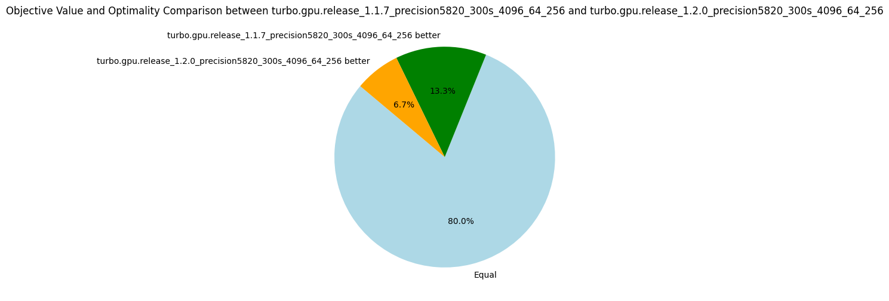
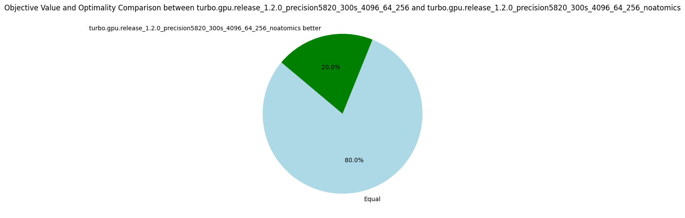
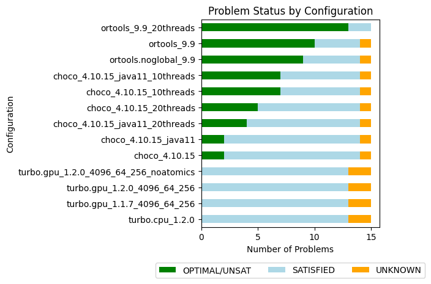

# v1.2.0: Refactoring

_21 September 2024._ Version 1.2 introduces a significant refactoring. Previously, the system operated using a lattice ordering where computations began from bottom and progressed upwards. This resulted in lattices being reversed compared to both abstract interpretation and the conventional ordering in lattice theory, such as with the interval lattice, where bottom typically represents the empty interval. All lattices now follow the standard ordering. Turbo now aligns more closely with the abstract satisfaction framework and terminology as presented by D’Silva et al. in their 2014 paper, [Abstract Satisfaction](https://dl.acm.org/doi/pdf/10.1145/2535838.2535868), published at the POPL conference.

Another issue addressed in this update is the incorrect handling of multiplication and division over infinite intervals.
While this feature hadn’t been used in prior experiments, resolving it proved non-trivial.
It is now sound, although the consistency could be stronger.
For instance, I haven’t yet established the rules for dividing by infinity, so the result is currently overapproximated to top. You can find the full changelog [here](https://github.com/ptal/turbo/releases/tag/v1.2.0).

Starting with this release, we’ve removed RCPSP instances from the experimental dataset to avoid skewing the metrics.
We continue to track the number of nodes processed per second.
Thibault, a postdoc on the team, mentioned that this was the first time he had encountered anyone monitoring this particular metric, so I’d like to explain its importance.
This metric allows us to compare solvers that are similar in terms of constraint consistency, yet differ in terms of algorithms and optimizations.
As noted in earlier posts, some optimizations, such as sharing or sorting propagators, have little to do with constraint programming itself.
In these cases, comparing the number of nodes explored per second provides valuable insights.
However, it doesn’t make sense to compare nodes-per-second between Choco and OrTools, as their underlying algorithms are different.
For now, we’ll continue evaluating this metric across different Turbo versions.
To better assess the impact of optimizations, we’re also calculating the normalized average, which, in hindsight, should have been implemented from the start, given that nodes-per-second can vary widely between problems.

Overall, we observed a 7% improvement in exploration speed, with performance dips in only four problems.
For the WordPress instance, we noted a small decrease in nodes processed, from 91775 to 86468, which accounts for the lower objective.
For ACCAP (a40_f800), the objectives found are very close (2549 vs. 2545), and after rerunning the problem on a laptop, we obtained an objective of 2542, which we’ll attribute to (insignificant) machine fluctuations.
The median nodes-per-second metric decreased by 17%, but after closer inspection, the only substantial drop occurred in the triangular/n39.dzn problem, where the nodes-per-second decreased from 828,963 to 686,341.
This is because this problem happens to sit at the midpoint of the distribution.

The number of fixpoint iterations per node increased slightly (+4%) on average, likely due to the 16% rise in the number of propagators.
The increase in propagators is due to the removal of the "lattice propagator" mentioned in v1.1.2, it did not prove as useful as expected.
However, the number of fixpoint iterations is compensated by an 11% increase in the number of iterations per second, so overall efficiency has improved.
In conclusion, the refactoring has positively impacted efficiency in terms of nodes-per-second, without significantly affecting the quality of objective bounds.

| Metrics | Normalized average [0,100] | Δ v1.1.7 | #best (_/15) | Average | Δ v1.1.7 | Median | Δ v1.1.7 |
|---------|----------------------------|----------|--------------|---------|----------|--------|----------|
| Nodes per second | 97.45 | +7% | 11 | 10846.81 | +21% | 2287.35 | -17% |
| Fixpoint iterations per second | 98.33 | +11% | 13 | 61386.99 | +23% | 27328.03 | +15% |
| Fixpoint iterations per node | 99.18 | +4% | 4 | 14.67 | +3% | 8.59 | +7% |
| Propagators memory | 99.50 | +16% | 2 | 10.97MB | +16% | 4.30MB | +34% |
| Variables store memory | 99.97 | 0% | 1 | 51.43KB | 0% | 6.74KB | 0% |

| Metrics | Count | Δ v1.1.7 |
|---------|-------|----------|
| #Problems at optimality | 0 | 0 |
| #Problems satisfiable | 13 | 13  |
| #Problems unknown | 2 | 2  |
| #Problem with store in shared memory | 9 | 9  |
| #Problem with prop in shared memory | 1 | 1  |
| #Problems with IDLE SMs at timeout | 2 | 1 |

## Shared Memory vs Global Memory

On GPUs, each streaming multiprocessor has an L1 cache, which is extremely fast but relatively small (around 100KB, depending on the GPU model).
A portion of the L1 cache, known as shared memory, can be reserved to store frequently accessed data, reducing the need for roundtrips between L1 cache, L2 cache, and global memory.

In our case, there are seven problems where the variable store can be held in shared memory, and one additional problem where both the propagators and the variables store can fit in shared memory.
Implementing this optimization is complex, as it requires using C++-templates for all data structures with the memory allocator's type.

The key question is: does this optimization improve efficiency?
To find out, we ran experiments on these seven problems, comparing the performance of Turbo with shared memory optimization against a version of Turbo that uses global memory exclusively (v1.2.0-gmem).

| Metrics | Normalized average [0,100] | Δ v1.2.0-gmem | #best (_/7) | Average | Δ v1.2.0-gmem | Median | Δ v1.2.0-gmem |
|---------|----------------------------|----------|--------------|---------|----------|--------|----------|
| Nodes per second | 100.00 | +5% | 7 | 19068.33 | +4% | 22729.96 | +5% |
| Fixpoint iterations per second | 100.00 | +4% | 7 | 109048.09 | +4% | 58060.52 | +3% |
| Fixpoint iterations per node | 99.76 | 0% | 4 | 6.16 | 0% | 5.38 | 0% |
| Propagators memory | 100.00 | 0% | 0 | 7.07MB | 0% | 0.63MB | 0% |
| Variables store memory | 100.00 | 0% | 0 | 4.98KB | 0% | 4.22KB | 0% |

| Metrics | Count | Δ v1.2.0-gmem |
|---------|-------|----------|
| #Problems at optimality | 0 | 0 |
| #Problems satisfiable | 6 | 6  |
| #Problems unknown | 1 | 1  |
| #Problem with store in shared memory | 6 | 0  |
| #Problem with prop in shared memory | 1 | 0  |
| #Problems with IDLE SMs at timeout | 0.0 | 0.0 |

Using shared memory consistently improved the number of nodes processed per second on these problems, and there were no cases where performance was negatively affected.
But honestly, +5% was hardly worth the troubles of programming with allocators.
That said, it's possible that the benefits of this optimization are being overshadowed by other GPU-related issues, such as the high number of registers in use.
We plan to benchmark it again in the future to determine whether it delivers a more substantial performance boost.

## The Impact of Atomics

For correctness, every integer load and store operation must be wrapped in an atomic transaction.
Without this, there's a risk that one thread could write to the first two bytes of an integer while another thread writes to the last two, leading to corrupted data.
But what happens if we transgress the rule and remove atomics?
To explore this, we address two questions: are the results still correct without atomics, and what is the performance cost of using them?

In terms of raw efficiency, the number of nodes explored per second increased by 13%, which is an interesting gain.
Additionally, we didn’t encounter any bugs—all the results were correct.
This suggests one of two possibilities: either 32-bit integer loads and stores are inherently atomic on this hardware, or race conditions are so rare that they weren’t detected, even after several hours of computation.
Since we can’t be sure, we have to adhere to the formal CUDA semantics, and therefore keep atomics to guarantee correctness!

| Metrics | Normalized average [0,100] | Δ v1.2.0 | #best (_/15) | Average | Δ v1.2.0 | Median | Δ v1.2.0 |
|---------|----------------------------|----------|--------------|---------|----------|--------|----------|
| Nodes per second | 100.00 | +13% | 15 | 12146.40 | +12% | 2680.12 | +17% |
| Fixpoint iterations per second | 99.52 | +13% | 14 | 74963.50 | +22% | 30621.28 | +12% |
| Fixpoint iterations per node | 96.84 | 0% | 7 | 15.24 | +4% | 8.74 | +2% |
| Propagators memory | 100.00 | 0% | 0 | 10.97MB | 0% | 4.30MB | 0% |
| Variables store memory | 100.00 | 0% | 0 | 51.43KB | 0% | 6.74KB | 0% |

| Metrics | Count | Δ v1.2.0 |
|---------|-------|----------|
| #Problems at optimality | 0 | 0 |
| #Problems satisfiable | 13 | 13  |
| #Problems unknown | 2 | 2  |
| #Problem with store in shared memory | 9 | 9  |
| #Problem with prop in shared memory | 1 | 1  |
| #Problems with IDLE SMs at timeout | 2 | 2 |

## More Benchmarks

We did additional benchmarks to run OrTools and Choco in parallel, Choco with Java11 and Java22, and Turbo on CPU.

| Name                             |   Average nodes-per-second |   #Problems at optimality |   #Problems SAT |   #Problems unknown |
|:--------------------------------------|-----------------------:|------------------:|--------------:|------------------:|
| ortools_9.9_20threads                 |                -       |                13 |             2 |                 0 |
| ortools_9.9                           |             13453.8    |                10 |             4 |                 1 |
| ortools.noglobal_9.9                  |             15035.4    |                 9 |             5 |                 1 |
| choco_4.10.15_10threads               |             26081.2    |                 7 |             7 |                 1 |
| choco_4.10.15_java11_10threads        |             21082.7    |                 7 |             7 |                 1 |
| choco_4.10.15_20threads               |              9564.2    |                 5 |             9 |                 1 |
| choco_4.10.15_java11_20threads        |             12708.8    |                 4 |            10 |                 1 |
| choco_4.10.15                         |             11527.6    |                 2 |            12 |                 1 |
| choco_4.10.15_java11                  |             10459.6    |                 2 |            12 |                 1 |
| turbo.gpu_1.2.0_4096_64_256_noatomics |             12146.4    |                 0 |            13 |                 2 |
| turbo.gpu_1.2.0_4096_64_256           |             10846.8    |                 0 |            13 |                 2 |
| turbo.gpu_1.1.7_4096_64_256           |              8997.1    |                 0 |            13 |                 2 |
| turbo.cpu_1.2.0                       |              3673.46   |                 0 |            13 |                 2 |

The version of Java plays a significant role in performance, showing a speedup of 10% to 25% when moving from Java 11 to Java 22, which is now the default version for our experiments.
Interestingly, Choco doesn't handle excessive threading well-one thread per core consistently outperforms two threads per core.

The sequential CPU version of Turbo isn't performing too badly, exploring 3673 nodes per second.
With this in mind, it's reasonable to target a similar rate per streaming multiprocessor (SM) on the GPU.
Given that we have 64 SMs, we should aim to reach at least 235k nodes per second overall.

Improving this metric will be the primary focus for future 1.2.* versions.

## Roadmap for 1.2.*

The full GPU design is approaching its limits as the code has grown significantly.
After discussions with Nvidia engineers, who are partners in the COMOC project, it appears that the primary inefficiency may be due to the excessive number of registers used.
Here’s the plan moving forward:

1. Implement a parallel version of the CPU-based Turbo.
2. Replace the CPU-based propagation with GPU-based propagation using the parallel version.
3. Limit memory transfers, if they become a bottleneck, by transferring only the variables involved in the search strategy.
4. Improve the propagators abstract domain to disable entailed propagators.
5. Minimize thread divergence by applying a binary decomposition to all constraints.
