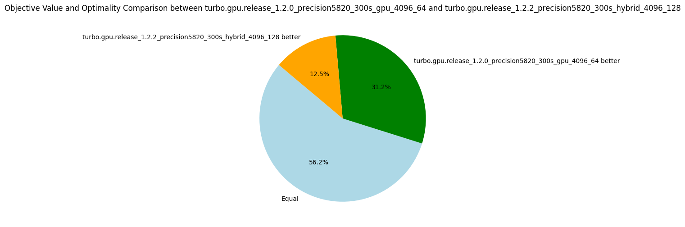
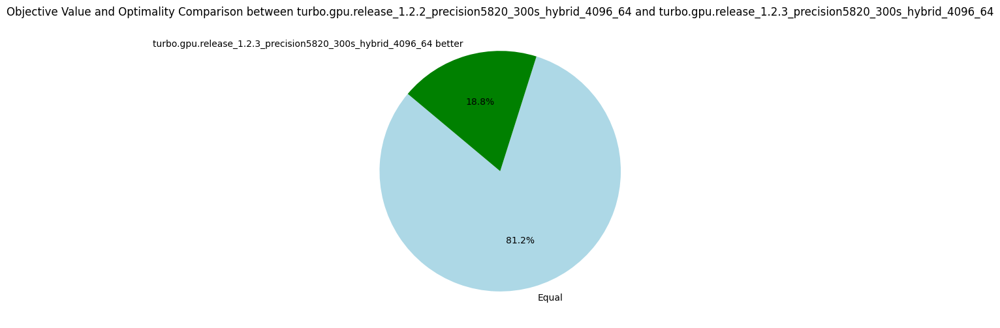
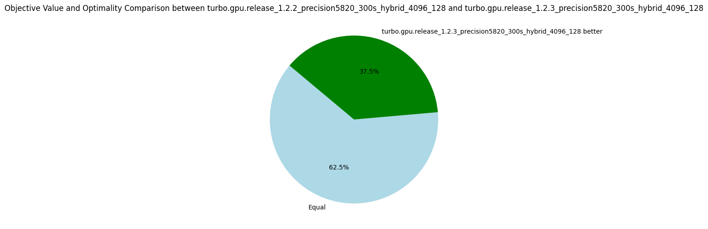
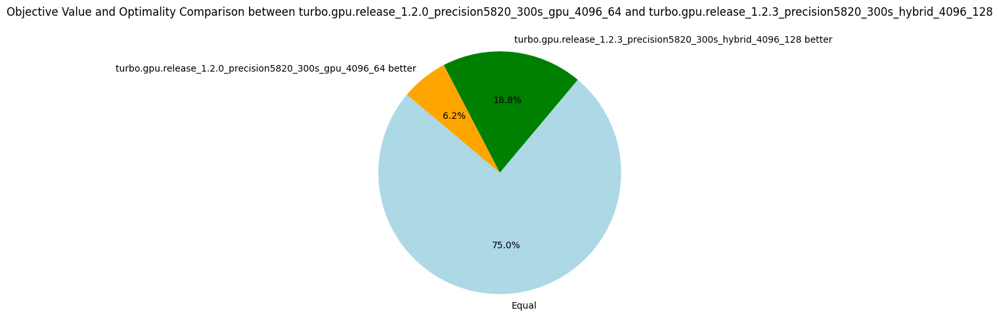

# v1.2.{1,2,3}: Open Hackathon

_17 October 2024_ We are participating in the [Poland Open Hackathon](https://www.openhackathons.org/s/siteevent/a0C5e000009W8MqEAK/se000307?p=4OVal7qBAY6%2FFLWHyETbkwh66SClhyelBl79%2FR1tID1ERZR9ly9oZEseBU%2B%2FQOAe%2B1PJ%2BAdY%2F%2F62bDJM0SlZYg%3D%3D).
This page will summarize our progresses and experience.
The hackathon is spread over 2 weeks starting by a meeting on 15 October to explain the GH200 architecture that equip the [Helios HPC](https://www.cyfronet.pl/en/19951,artykul,helios_supercomputer.html), how to connect and run jobs on it, and then discuss with our mentors (Akif Çördük (Nvidia), Alice Boucher (Nvidia), Michel Herrera Sanchez).
Among the mentors, we are lucky to have two engineers from Nvidia working on [cuOpt](https://developer.nvidia.com/blog/record-breaking-nvidia-cuopt-algorithms-deliver-route-optimization-solutions-100x-faster/) and a new secret [linear programming solver](https://developer.nvidia.com/blog/accelerate-large-linear-programming-problems-with-nvidia-cuopt/).
During the meeting, I try to compile Turbo on the HPC and... boom, `nvcc` is killed by the memory manager because it is using too much memory.
I encountered a similar problem last year and reported the bug to Nvidia.
The bug was closed as "will not fix", the reason is that our kernel is just too large and we should split it in smaller kernels.
But by adding `__noinline__` attributes in key places, I could work around it and compile it on `sm_70` and `sm_86` architectures.
It seems that for `sm_90` architectures (of the GH200), the compiler is again doing very aggressive optimizations, and Turbo is just too large for it.
By putting the full solver in a single kernel, we avoid the memory transfers between the CPU and GPU, but even when the code is compiling, the bottleneck is the high number of registers per thread and the size of the kernel.
The next meeting is on 22 October, for the whole day.
Without a code that is compiling, it is going to be hard to profile and optimize anything...
After a few days, I managed to develop a new hybrid algorithm where only the propagation loop is on the GPU, and the search is on the CPU.
It is now compiling fine on Helios.
The real hackathon took place online on 28, 29 and 30 of October, each time we stayed connected online and discussed with the mentors when needed from around 9AM to 3 or 4PM.

Let's see an executive summary of the versions used and developed during this hackathon:

* _15 October 2024_: Turbo 1.2.0 is not compiling on Helios (ptxas is memkill).
  * Reason: Kernel is too large.
* _22 October 2024_: New design with a smaller kernel (Turbo v1.2.1).
  * The CPU controls the search loop, a kernel is run each time we propagate.
  * Use N CPU threads, each launching a kernel with 1 block using stream.
  * Compiling, but too slow, too many streams (only `1628` nodes per second...).
* _28 October 2024_: New design with a persistent kernel (v1.2.2).
  * N CPU threads communicate with N blocks of a persistent kernel.
  * Compiling, on-par with the full GPU version.
* _30 October 2024_: Deactivating entailed propagators (v1.2.3).
  * Use [CUB scan](https://nvidia.github.io/cccl/cub/api/classcub_1_1BlockScan.html) to deactivate propagators that are entailed during search.
  * Obtained 10% speed-up.

## Hybrid Dive and Solve Algorithm (v1.2.2)

If you don't know the "propagate-and-search" algorithm of constraint programming, please watch [this video](https://youtu.be/vAzGmkOJveY) I made for the AAAI conference (thanks Covid), starting at 5'30'' (if you already your basics about GPU).
It also explains how this algorithm is executed in parallel on GPU.

We keep the same algorithm as full-GPU Turbo but only performs the propagation on the GPU.
The algorithm consists of two parts:

1. `dive(root, path)`: From the root of the search tree, commit to the path given to reach a node `subroot` at a fixed depth.
2. `solve(subroot)`: Solve the subproblem `subroot` by propagate and search.
3. When a subproblem has been completely explored, we take a new path to explore if any is left.

During the dive and solve operations, the propagation step is always executed on the GPU.
Starting from version 1.2.2, we execute a single kernel and each CPU thread interacts with a single block of that persistent kernel.
We compare the full-GPU architecture and this hybrid architecture in the following table (this is on my desktop computer (RTX A5000) due to 1.2.0 not compiling on Helios).

| Metrics | Normalized average [0,100] | Δ v1.2.0 | #best (_/16) | Average | Δ v1.2.0 | Median | Δ v1.2.0 |
|---------|----------------------------|----------|--------------|---------|----------|--------|----------|
| Nodes per second | 93.93 | -4% | 7 | 10271.03 | -1% | 2519.29 | -19% |
| Fixpoint iterations per second | 95.76 | -2% | 7 | 60155.16 | -1% | 31502.75 | -1% |
| Fixpoint iterations per node | 99.76 | +2% | 6 | 16.77 | +15% | 9.00 | 0% |

The hybrid version is slightly less efficient than with the full-GPU version, but considering the number of round-trips between the CPU and GPU I was expecting worst results.
Nonetheless, because the kernel is now smaller, we can execute more blocks in parallel.
With 128 blocks, we surpass the version v1.2.0 as shown in the following table.

| Metrics | Normalized average [0,100] | Δ v1.2.0 | #best (_/16) | Average | Δ v1.2.0 | Median | Δ v1.2.0 |
|---------|----------------------------|----------|--------------|---------|----------|--------|----------|
| Nodes per second | 94.97 | +5% | 8 | 13475.41 | +29% | 3029.66 | -2% |
| Fixpoint iterations per second | 94.53 | +4% | 8 | 81399.98 | +33% | 33540.01 | +5% |
| Fixpoint iterations per node | 97.39 | 0% | 11 | 15.43 | +5% | 9.20 | +2% |

In terms of the best objectives found, the hybrid version performs better with 64 blocks than with 128 blocks.
Indeed, with 128 blocks, we explore a wider search tree at the cost of exploring fewer nodes per block.
It is known as the exploration-exploitation dilemma.
Until we implement better search strategies and test with a longer timeout, I prefer to stick to the nodes per second metric in order to compare the raw efficiency.

## Deactivating Entailed Propagators and No Atomic (v1.2.3)

A frequent optimization is to avoid calling propagators that are entailed in the fixpoint loop.
To give a very simple example, if `x=[1,3]`, then for sure we know that `x > 0` is satisfied and will remain satisfy for the rest of the exploration of the current subtree.
Therefore, the propagator implementing `x > 0` does not need to be executed anymore.
To deactivate entailed propagators, we keep an array `vector<int> indexes` giving the indexes of the propagators not yet entailed.
The fixpoint loop can be easily modified to iterate over `indexes` instead of iterating from `0` to `P` where `P` is the number of propagators.
Furthermore, it is easy to verify in parallel that each propagator is entailed because this is a read-only check, therefore we can assign one thread to each propagator we need to check.
This step produces a mask `vector<bool> mask` representing which propagators are still alive.
The difficult part is to create the new array `indexes` representing that subset in parallel.
This is a known problem in GPU programming and the scan algorithm (aka. prefix sum) allows to parallelize this step and to copy into a new array `indexes2` only the values `indexes[i]` such that `mask[indexes[i]]` is `true`.

This version comes with a more important optimization.
It is actually known that tearing on integers is not possible in CUDA (i.e., a thread writing half of an integer while the other thread write the other half).
Although it is not formally documented a lot of code relies on load/store atomicity of primitive types.
Therefore, we can safely remove the atomic unlike what I concluded in the [v1.2.0 post](https://lattice-land.github.io/8-turbo.html).

This optimization proves very useful with a 17% increase in nodes per second with 64 blocks, and a 28% increase with 128 blocks.
Previously, removing atomic variables accounted for a 13% increase, and therefore is probably the reason behind this speed-up as well, while deactivating the propagators does not hurt, but it is not as crucial as other optimization.

| Metrics | Normalized average [0,100] | Δ v1.2.2 | #best (_/16) | Average | Δ v1.2.2 | Median | Δ v1.2.2 |
|---------|----------------------------|----------|--------------|---------|----------|--------|----------|
| Nodes per second | 99.59 | +17% | 14 | 11786.66 | +15% | 3252.29 | +29% |
| Fixpoint iterations per second | 100.00 | +24% | 16 | 81532.87 | +36% | 43905.01 | +39% |
| Fixpoint iterations per node | 99.08 | +5% | 4 | 18.60 | +11% | 9.10 | +1% |

| Metrics | Normalized average [0,100] | Δ v1.2.2 | #best (_/16) | Average | Δ v1.2.2 | Median | Δ v1.2.2 |
|---------|----------------------------|----------|--------------|---------|----------|--------|----------|
| Nodes per second | 99.96 | +28% | 15 | 18543.27 | +38% | 4082.88 | +35% |
| Fixpoint iterations per second | 100.00 | +35% | 16 | 129459.21 | +59% | 48995.62 | +46% |
| Fixpoint iterations per node | 98.94 | +5% | 4 | 17.00 | +10% | 9.19 | 0% |

This new version also dominates the previous one in terms of objective found.
Further, we almost close the gap with the full GPU version v1.2.0 which remains better on only 1 problem.

## Helios Benchmarks

We now try the new versions on Helios which is equipped with a superchip GH200 consisting of a CPU of 72 cores and a H200 GPU with 132 SMs whereas my desktop has a CPU with 10 cores and a RTX A5000 GPU with 64 SMs.
The speedup we get with GH200 shows our algorithm scales well, by doubling the number of SMs, we also double the number of nodes per second.
The following table compares the hybrid versions with 1 block per SM on my desktop and Helios.

| Metrics | Normalized average [0,100] | Δ v1.2.2 | #best (_/16) | Average | Δ v1.2.2 | Median | Δ v1.2.2 |
|---------|----------------------------|----------|--------------|---------|----------|--------|----------|
| Nodes per second | 100.00 | +128% | 16 | 33232.29 | +224% | 7796.88 | +209% |
| Fixpoint iterations per second | 100.00 | +137% | 16 | 184996.45 | +208% | 69359.75 | +120% |
| Fixpoint iterations per node | 98.32 | +4% | 6 | 19.11 | +14% | 10.03 | +11% |

We have more than a linear scaling, probably due to the larger L1 cache and other improvement in the H200 GPU.
We further improve the nodes per second metric by using 2 blocks per SM (264 blocks).

| Metrics | Normalized average [0,100] | Δ v1.2.2 | #best (_/16) | Average | Δ v1.2.2 | Median | Δ v1.2.2 |
|---------|----------------------------|----------|--------------|---------|----------|--------|----------|
| Nodes per second | 99.83 | +21% | 14 | 40330.87 | +21% | 9945.53 | +28% |
| Fixpoint iterations per second | 98.86 | +18% | 15 | 258809.97 | +40% | 78749.49 | +14% |
| Fixpoint iterations per node | 97.30 | -2% | 10 | 18.38 | -4% | 9.37 | -7% |

Finally, the version 1.2.3 gives an additional speedup, comparable than the one obtained on my desktop, as shown in the next table.

| Metrics | Normalized average [0,100] | Δ v1.2.2 | #best (_/16) | Average | Δ v1.2.2 | Median | Δ v1.2.2 |
|---------|----------------------------|----------|--------------|---------|----------|--------|----------|
| Nodes per second | 99.70 | +26% | 14 | 45520.83 | +13% | 15676.14 | +58% |
| Fixpoint iterations per second | 100.00 | +36% | 16 | 360362.70 | +39% | 116916.62 | +48% |
| Fixpoint iterations per node | 98.97 | +7% | 4 | 20.17 | +10% | 10.45 | +12% |

## Summary Hackathon

This hackathon was very useful.
All in all, the helped me to verify the correctness of the persistent kernel design (v1.2.2) and to use CUB to eliminate entailed propagators (v1.2.3).
More importantly, I could discuss with them about the overall design of Turbo, the fact that I aimed to be too general (code working both on CPU and GPU, using modern C++ patterns, etc.) which did not help for the performance.
During the three days, we also discussed a new design of propagators and the result will be in a post-hackathon version 1.2.4, so stay tuned :)

| short_uid                              |   avg_nodes_per_second |   problem_optimal |   problem_sat |   problem_unknown |
|:---------------------------------------|-----------------------:|------------------:|--------------:|------------------:|
| turbo.hybrid_GH200_1.2.3_4096_264        |               45520.8  |                 0 |            14 |                 2 |
| turbo.hybrid_GH200_1.2.2_4096_264        |               40330.9  |                 0 |            14 |                 2 |
| turbo.hybrid_GH200_1.2.3_4096_132        |               36589.3  |                 0 |            14 |                 2 |
| turbo.hybrid_GH200_1.2.2_4096_132        |               33232.3  |                 0 |            14 |                 2 |
| turbo.hybrid_RTXA5000_1.2.3_4096_128        |               18543.3  |                 0 |            14 |                 2 |
| turbo.hybrid_RTXA5000_1.2.2_4096_128        |               13475.4  |                 0 |            14 |                 2 |
| turbo.hybrid_RTXA5000_1.2.3_4096_64         |               11786.7  |                 0 |            14 |                 2 |
| turbo.gpu_RTXA5000_1.2.0_4096_64_noatomics  |               11684.4  |                 0 |            14 |                 2 |
| turbo.gpu_RTXA5000_1.2.0_4096_64            |               10412.7  |                 0 |            14 |                 2 |
| turbo.hybrid_RTXA5000_1.2.2_hybrid_4096_64         |               10271    |                 0 |            14 |                 2 |
| turbo.hybrid_RTXA5000_1.2.1_hybrid_4096_64         |                1628.89 |                 0 |            14 |                 2 |
